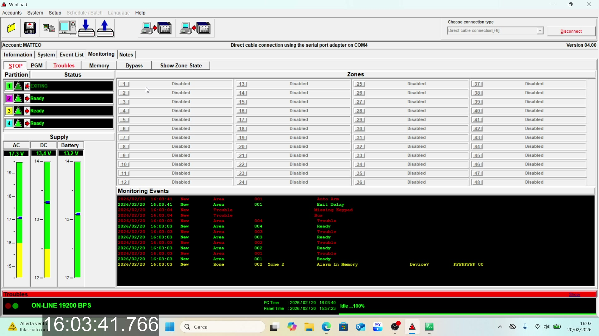
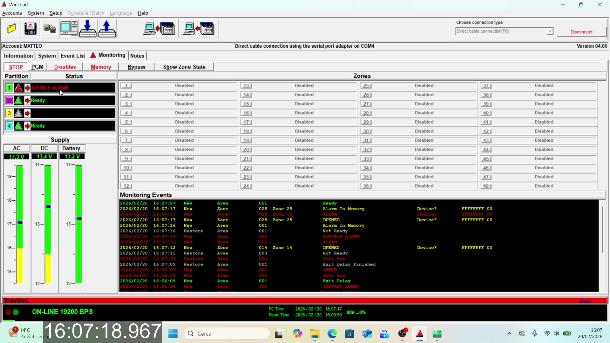

# Serial Capture Analysis — Paradox DGP-848

Captures taken 2026-02-20 using Eltima Serial Port Monitor on Windows, with Winload 4.00 connected to a DGP-848 panel via COM4 (19200 bps). OBS recorded the screen with a millisecond clock overlay for timestamp correlation.

Each capture includes:
- `.txt` — hex dump from Serial Port Monitor
- `.spm` — raw capture file
- `.mp4` — screen recording of Winload with OBS clock overlay

Files are organized into subfolders by scenario. Note: the original MP4 filenames for captures 1 and 2 were swapped at recording time, but each MP4 is now placed in its correct scenario folder.

## Winload Polling Cycle

Winload polls 4 RAM addresses per ~1s cycle:

| Address | Purpose |
|---------|---------|
| RAM 0x0195 | Partition status (4 × 5-byte blocks) |
| RAM 0x0144 | System info (time, voltage, trouble flags) |
| RAM 0x0164 | Zone/event flags (mostly static) |
| RAM 0x0184 | Overlapping window with 0x0195 (17-byte offset, covers P5-P8 area unused on DGP-848) |

---

## Capture 1: Instant Arm + Disarm

**Folder:** [`01-instant-arm/`](01-instant-arm/)
**Serial time:** 12:07:59 – 12:16:17 | **Video time:** 12:14:33 – 12:16:10

**Scenario:** Instant arm partition 1 → wait 60s exit delay → disarm partition 1

### Commands Sent

| Time | Command PDU | Decoded |
|------|-------------|---------|
| 12:14:53 | `40 00 60 00 ...` | P1=Disarm (pre-clear by Winload) |
| 12:14:58 | `40 00 40 00 ...` | P1=InstantArm (0x4) |
| 12:16:06 | `40 00 60 00 ...` | P1=Disarm |

### Partition 1 Status (RAM 0x0195)

| Time | byte0 | byte1 | byte2 | State |
|------|-------|-------|-------|-------|
| 12:07:59 – 12:14:58 | `0x00` | `0x09` | `0x00` | Disarmed, ready |
| 12:14:59 – 12:15:58 | `0x08` (bit3=no_entry) | `0x0B` (ready+exit_delay) | `0x04` | Exit delay (instant) |
| 12:15:59 – 12:16:06 | `0x09` (bit0+bit3) | `0x09` (ready) | `0x00` | **Instant armed** |
| 12:16:07+ | `0x00` | `0x09` | `0x00` | Disarmed, ready |

### Key Frames

| Frame | Description |
|-------|-------------|
|  | P1 "EXITING" countdown during exit delay |
|  | P1 "INSTANT ARMED" — exit delay finished |
|  | P1 "Ready" after disarm |

---

## Capture 2: Stay Arm + Entry Delay

**Folder:** [`02-stay-entry-delay/`](02-stay-entry-delay/)
**Serial time:** 12:19:25 – 12:21:09 | **Video time:** 12:19:09 – 12:21:09

**Scenario:** Stay arm partition 1 → wait 60s exit delay → door opens (entry delay) → disarm

### Commands Sent

| Time | Command PDU | Decoded |
|------|-------------|---------|
| 12:19:33 | `40 00 30 00 ...` | P1=StayArm (0x3) |
| 12:20:49 | `40 00 60 00 ...` | P1=Disarm |

### Partition 1 Status (RAM 0x0195)

| Time | byte0 | byte1 | byte2 | State |
|------|-------|-------|-------|-------|
| 12:19:25 – 12:19:33 | `0x00` | `0x09` | `0x00` | Disarmed, ready |
| 12:19:34 – 12:20:32 | `0x04` (bit2=stay) | `0x0B` (ready+exit_delay) | `0x04` | Exit delay (stay) |
| 12:20:33 – 12:20:39 | `0x05` (bit0+bit2) | `0x09` (ready) | `0x00` | **Stay armed** |
| 12:20:40 – 12:20:48 | `0x05` | `0x0C` (entry_delay, not ready) | `0x00` | **Entry delay** |
| 12:20:49 – 12:20:58 | `0x00` | `0x08` (not ready) | `0x00` | Disarmed (door open) |
| 12:20:59+ | `0x00` | `0x09` | `0x00` | Disarmed, ready |

### Key Frames

| Frame | Description |
|-------|-------------|
|  | P1 "EXITING" during stay arm exit delay |
|  | P1 armed in stay mode |
|  | P1 "Entry Delay" — door opened while armed |
|  | P1 back to "Ready" after disarm |

---

## Capture 3: Force Arm + Full Arm Sequence

**Folder:** [`03-sequence-arming/`](03-sequence-arming/)
**Serial time:** 12:22:54 – 12:25:56 | **Video time:** 12:22:38 – 12:25:56

**Scenario:** Force arm P2 → disarm during exit delay → Full arm P2 → wait exit delay → disarm. Then view Winload trouble display.

### Commands Sent

| Time | Command PDU | Decoded |
|------|-------------|---------|
| 12:23:01 | `40 00 05 00 ...` | P2=ForceArm (0x5) |
| 12:23:08 | `40 00 06 00 ...` | P2=Disarm |
| 12:23:16 | `40 00 02 00 ...` | P2=FullArm (0x2) |
| 12:24:22 | `40 00 06 00 ...` | P2=Disarm |

### Partition 2 Status (RAM 0x0195)

| Time | byte0 | byte1 | byte2 | State |
|------|-------|-------|-------|-------|
| 12:22:54 – 12:23:01 | `0x00` | `0x09` | `0x00` | Disarmed, ready |
| 12:23:02 – 12:23:08 | `0x02` (bit1=force) | `0x0B` (ready+exit_delay) | `0x04` | Exit delay (force) |
| 12:23:09 – 12:23:16 | `0x00` | `0x09` | `0x00` | Disarmed (cancelled) |
| 12:23:17 – 12:24:16 | `0x00` (no flags!) | `0x0B` (ready+exit_delay) | `0x04` | Exit delay (full arm) |
| 12:24:17 – 12:24:22 | `0x01` (bit0 only) | `0x09` (ready) | `0x00` | **Full armed** |
| 12:24:23+ | `0x00` | `0x09` | `0x00` | Disarmed, ready |

### Winload Trouble Display (12:24:35)

After disarming, the Winload trouble display was opened, which triggered reads of:
- RAM 0x01BC — trouble status flags
- EEPROM 0x1400-0x15E8 — trouble labels

### Key Frames

| Frame | Description |
|-------|-------------|
|  | P2 "EXITING" with force arm + "FORCE ARMED" in events |
|  | P2 back to ready after disarm during exit delay |
|  | P2 "EXITING" with regular full arm |
|  | P2 "ARMED" after exit delay |
|  | P2 back to ready after disarm |
|  | Winload trouble display (Missing Keypad, etc.) |

---

## Capture 4: Keypad Beep + Multi-Partition Arm

**Folder:** [`04-keypadbeep-misc/`](04-keypadbeep-misc/)
**Serial time:** 16:02:57 – 16:04:25

**Scenario:** Winload init/login → beep P1 keypad → full arm P1 → full arm P2 → disarm P2 during exit delay → disarm P1 during exit delay

### Init/Login Sequence

1. TX: 37 × `0xFF` (wake-up) → RX: `FF 00...00 FF` (panel acknowledges)
2. TX: `5F 20 00...00 7F` (init handshake) → RX: `00 00 08 10 00 04...37` (panel identification)
3. TX: echo panel ID with byte 12 changed `06→0A` (password) → RX: `10 00...00 10` (login success)

### Commands Sent

| Time | Command PDU | Decoded |
|------|-------------|---------|
| 16:03:13 | `40 00 80 00 ...` | P1=Beep (0x8) |
| 16:03:40 | `40 00 20 00 ...` | P1=FullArm (0x2) |
| 16:03:47 | `40 00 02 00 ...` | P2=FullArm (0x2) |
| 16:03:56 | `40 00 06 00 ...` | P2=Disarm (0x6) |
| 16:04:19 | `40 00 60 00 ...` | P1=Disarm (0x6) |

### Partition Status (RAM 0x0195)

| Time | P1 byte0,byte1 | P2 byte0,byte1 | State |
|------|----------------|----------------|-------|
| 16:03:00 – 16:03:39 | `0x00, 0x09` | `0x00, 0x09` | Both disarmed, ready |
| 16:03:41 – 16:03:46 | `0x00, 0x0B` | `0x00, 0x09` | P1 exit delay, P2 disarmed |
| 16:03:47 – 16:03:55 | `0x00, 0x0B` | `0x00, 0x0B` | Both in exit delay |
| 16:03:57 – 16:04:18 | `0x00, 0x0B` | `0x00, 0x09` | P1 exit delay, P2 disarmed |
| 16:04:19+ | `0x00, 0x09` | `0x00, 0x09` | Both disarmed, ready |

Both partitions were disarmed during exit delay — neither reached the armed state (byte0 stayed `0x00`). This confirms full arm during exit delay has no arm type bits in byte 0.

### Key Frames

| Frame | Description |
|-------|-------------|
|  | P1 "EXITING" after full arm command |
|  | P1 + P2 both "EXITING" simultaneously |
|  | P2 disarmed while P1 still in exit delay |
|  | Both back to "Ready" after disarming P1 |

---

## Capture 5: Instant Arm + Audible Alarm

**Folder:** [`05-instant-siren/`](05-instant-siren/)
**Serial time:** 16:05:57 – 16:07:43

**Scenario:** Winload init/login → instant arm P1 → wait 60s exit delay → door opens → audible alarm (instant = no entry delay, straight to alarm) → disarm

### Commands Sent

| Time | Command PDU | Decoded |
|------|-------------|---------|
| 16:06:08 | `40 00 40 00 ...` | P1=InstantArm (0x4) |
| 16:07:23 | `40 00 60 00 ...` | P1=Disarm (0x6) |

### Partition 1 Status (RAM 0x0195)

| Time | byte0 | byte1 | byte2 | State |
|------|-------|-------|-------|-------|
| 16:06:00 – 16:06:08 | `0x00` | `0x09` | `0x00` | Disarmed, ready |
| 16:06:09 – 16:07:07 | `0x08` (bit3=no_entry) | `0x0B` (ready+exit_delay) | `0x04` | Exit delay (instant) |
| 16:07:08 – 16:07:16 | `0x09` (bit0+bit3) | `0x09` (ready) | `0x00` | **Instant armed** |
| 16:07:17 – 16:07:23 | **`0x59`** (armed+no_entry+strobe+audible) | `0x19` (ready+alarm_in_memory) | `0x00` | **Audible alarm** |
| 16:07:24+ | `0x00` | **`0x19`** (ready+alarm_in_memory) | `0x00` | Disarmed, alarm in memory |

**Alarm byte breakdown:** `0x59 = 0101_1001` → bit0 (armed) + bit3 (no_entry) + bit4 (strobe_alarm) + bit6 (audible_alarm)

Zone 14 opened at 16:07:12 while instant armed → alarm triggered immediately (no entry delay with instant arm). Zone flags at RAM 0x0164 byte offset 29 changed from `0x00` to `0xC0` during alarm.

### Key Frames

| Frame | Description |
|-------|-------------|
|  | P1 "EXITING" during instant arm exit delay |
|  | P1 "INSTANT ARMED" — exit delay finished |
|  | P1 "AUDIBLE ALARM" — zone opened, siren active |
|  | P1 disarmed after alarm — "AUDIBLE ALARM" still displayed |

---

## Partition Status Byte Map (from captures)

### Byte 0 — Arm/Alarm Flags

```
bit 0 (0x01) = ARMED         — set after exit delay completes
bit 1 (0x02) = FORCE_ARM     — set immediately on ForceArm command
bit 2 (0x04) = STAY_ARM      — set immediately on StayArm command
bit 3 (0x08) = NO_ENTRY      — set immediately on InstantArm command
bit 4 (0x10) = STROBE_ALARM
bit 5 (0x20) = SILENT_ALARM
bit 6 (0x40) = AUDIBLE_ALARM
bit 7 (0x80) = unknown
```

| Arm Type | During Exit Delay | Fully Armed |
|----------|-------------------|-------------|
| Full Arm | `0x00` | `0x01` |
| Force Arm | `0x02` | `0x03` |
| Stay Arm | `0x04` | `0x05` |
| Instant Arm | `0x08` | `0x09` |

### Byte 1 — Status Flags

```
bit 0 (0x01) = READY            — all zones in partition are closed
bit 1 (0x02) = EXIT_DELAY       — exit delay countdown active
bit 2 (0x04) = ENTRY_DELAY      — entry delay countdown active
bit 3 (0x08) = always set       — likely "partition enabled/supervised"
bit 4 (0x10) = ALARM_IN_MEMORY  — alarm was triggered, persists until acknowledged
```

### Byte 2 — Extra

Value `0x04` during exit delay only. `0x00` otherwise.

---

## Monitor Command PDU Format (0x40)

```
Byte[0]  = 0x40 (command type = Monitor)
Byte[1]  = 0x00 (bus address)
Byte[2]  = (P1_cmd << 4) | P2_cmd    ← nibble-packed
Byte[3]  = (P3_cmd << 4) | P4_cmd
Byte[4]  = (P5_cmd << 4) | P6_cmd
Byte[5]  = (P7_cmd << 4) | P8_cmd
Byte[6-35] = 0x00
Byte[36] = checksum (sum of bytes 0-35 mod 256)
```

Panel echoes the exact same PDU as acknowledgment.

### Command Codes (4-bit)

| Code | Command |
|------|---------|
| 0x0 | Nop |
| 0x2 | Full Arm |
| 0x3 | Stay Arm |
| 0x4 | Instant Arm |
| 0x5 | Force Arm |
| 0x6 | Disarm |
| 0x8 | Beep |

---

## Additional Observations

- **Winload pre-clear:** Before InstantArm, Winload sends a Disarm first (safety). Not observed before Stay/Force/Full arm.
- **Exit delay duration:** 60 seconds for all arm types, including instant arm.
- **Command latency:** State change reflected in next poll cycle (< 1 second).
- **P3 ready flicker:** Partition 3 (radar ground floor) loses ready bit intermittently — user was physically triggering the radar sensor during recording.
- **PC Time vs Panel Time:** Panel clock runs ~6 minutes behind PC clock. Serial monitor uses PC timestamps.
- **Init sequence:** Winload sends 37 × `0xFF` (wake-up) before the `0x5F 0x20` init handshake. Panel responds to wake-up with `FF 00...00 FF`.
- **No close packet:** Winload does not send a protocol-level disconnect. It simply drops the serial connection.
- **Alarm in memory:** After an alarm is disarmed, byte1 bit4 (0x10) persists until the alarm is acknowledged, causing byte1 = `0x19` instead of the usual `0x09`.
- **Instant arm = no entry delay:** When a zone opens while instant armed, the alarm triggers immediately — there is no entry delay countdown.
